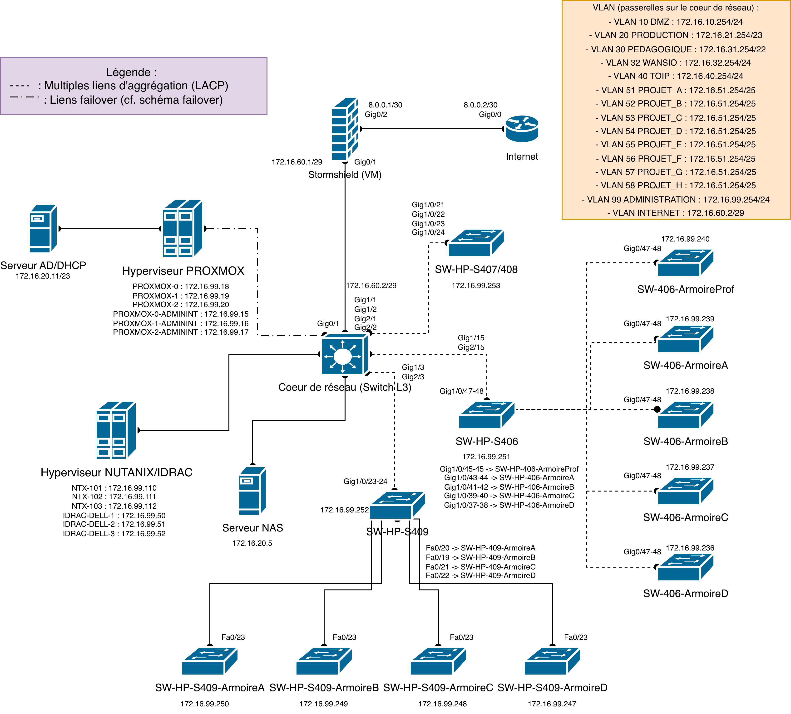

# Documentation de l'infrastructure réseau et systèmes
**Lycée Paul-Louis Courier — Section SIO**
**Version :** 1.0 — Juin 2026
**Auteur :** Ewen Gadonnaud (stagiaire BTS SIO 1ère année)
**Responsable de complétion :**  M. BALNY David

> **Usage :** ce document est destiné aux nouveaux arrivants dans la section SIO. Il décrit l'infrastructure réseau et systèmes, les configurations des équipements et les procédures courantes. Aucun identifiant ou mot de passe ne doit figurer dans ce document — référencer uniquement le gestionnaire de secrets de la section.

---

## Table des matières

1. [Vue d'ensemble](#1-vue-densemble)
2. [Plan d'adressage et VLAN](#2-plan-dadressage-et-vlan)
3. [Topologie réseau](#3-topologie-réseau)
4. [Fiches équipements réseau](#4-fiches-équipements-réseau)
5. [Configurations types](#5-configurations-types)
6. [Serveurs et virtualisation](#6-serveurs-et-virtualisation)
7. [Services](#7-services)
8. [Procédures courantes](#8-procédures-courantes)
9. [Accès et identifiants](#9-accès-et-identifiants)
10. [Glossaire](#10-glossaire)
11. [Historique des modifications](#11-historique-des-modifications)

---

## 1. Vue d'ensemble

### Périmètre

Ce document couvre l'ensemble de l'infrastructure réseau et systèmes exploitée par la section SIO du lycée Paul-Louis Courier (Tours), répartie sur plusieurs salles de travaux pratiques et une baie serveurs.

### Répartition des salles

| Salle | Rôle | Équipement réseau principal |
|-------|------|-----------------------------|
| Salle 406 | TP réseau | HP A5120 EI (Comware 5) |
| Salle 407 | TP réseau | FlexNetwork 5120 EI (Comware 5) |
| Salle 408 | TP réseau | FlexNetwork 5120 EI (Comware 5) |
| Salle 409 | TP réseau | HPE 5140 EI (Comware 7) |
| Baie serveurs | Infrastructure prod | Aruba 3810M (cœur), cluster Proxmox, serveurs AD |

### Schéma logique simplifié



> **Note :** remplacer ce schéma textuel par le diagramme draw.io/Packet Tracer finalisé.

---

## 2. Plan d'adressage et VLAN

### VLANs définis

| ID VLAN | Nom | Usage | Sous-réseau |
|---------|-----|-------|-------------|
| 32 | VLAN-SIO-MGMT | Supervision et gestion infrastructure | 172.16.32.0/24 |
| 20 | VLAN-SIO-PROD | Services de production (AD, Zabbix, Grafana) | 172.16.20.0/24 |
| _À compléter_ | | | |

### Adresses IP des équipements clés

| Équipement | Hostname | Adresse IP | VLAN | Rôle |
|------------|----------|------------|------|------|
| Aruba 3810M | — | _À compléter_ | — | Commutateur cœur |
| HPE 5140 EI | — | _À compléter_ | — | Commutateur salle 409 |
| FlexNetwork 5120 EI | — | _À compléter_ | — | Commutateur salle 407/408 |
| HP A5120 EI | — | _À compléter_ | — | Commutateur salle 406 |
| Cisco Catalyst 2960 | — | _À compléter_ | — | Distribution |
| Cisco 1921 | — | _À compléter_ | — | Routeur |
| pve0 | pve0 | _À compléter_ | 20 | Nœud Proxmox |
| pve1 | pve1 | _À compléter_ | 20 | Nœud Proxmox |
| pve2 | pve2 | _À compléter_ | 20 | Nœud Proxmox |
| AD-01 | — | 172.16.20.21 | 20 | Contrôleur de domaine principal |
| AD-02 | — | 172.16.20.22 | 20 | Contrôleur de domaine secondaire |
| Zabbix (prod) | PRODUCTION-ZABBIX | 172.16.20.7 | 20 | Serveur de supervision |
| Grafana (prod) | PRODUCTION-GRAFANA | 172.16.20.6 | 20 | Tableau de bord supervision |

---

## 3. Topologie réseau

### Architecture générale

L'infrastructure SIO s'articule autour d'un **cœur Aruba 3810M** situé en baie serveurs, auquel sont raccordés les commutateurs de chaque salle. Les liens inter-commutateurs sont agrégés (EtherChannel / LACP) pour la redondance et la bande passante.

### Liens inter-équipements

| Lien | Protocole d'agrégation | Débit | Remarques |
|------|------------------------|-------|-----------|
| Aruba 3810M ↔ HPE 5140 EI (salle 409) | _À compléter_ | _À compléter_ | |
| Aruba 3810M ↔ FlexNetwork 5120 EI (407/408) | _À compléter_ | _À compléter_ | |
| Aruba 3810M ↔ HP A5120 EI (salle 406) | _À compléter_ | _À compléter_ | |
| Aruba 3810M ↔ Cisco Catalyst 2960 | _À compléter_ | _À compléter_ | Lien montant |

### Ports de trunk (tagged)

_À compléter : indiquer les VLANs autorisés sur chaque lien trunk._

---

## 4. Fiches équipements réseau

> Dupliquer ce gabarit pour chaque équipement.

---

### 4.1 Aruba 3810M — Commutateur cœur

| Champ | Valeur |
|-------|--------|
| **Modèle** | Aruba 3810M |
| **OS / Version** | ArubaOS-Switch — _À compléter_ |
| **Localisation** | Baie serveurs |
| **Adresse IP de gestion** | _À compléter_ |
| **Rôle** | Commutateur cœur, agrégation de l'ensemble des salles SIO |
| **VLANs portés** | _À compléter_ |
| **Liens d'agrégation** | _À compléter_ |
| **SNMPv3** | Configuré — protocole auth SHA, chiffrement DES |
| **Dernière sauvegarde conf** | _À compléter_ |
| **Remarques** | _À compléter_ |

---

### 4.2 HPE 5140 EI — Salle 409

| Champ | Valeur |
|-------|--------|
| **Modèle** | HPE 5140 EI |
| **OS / Version** | Comware 7 — _À compléter_ |
| **Localisation** | Salle 409 |
| **Adresse IP de gestion** | _À compléter_ |
| **Rôle** | Commutateur d'accès salle 409 |
| **VLANs portés** | _À compléter_ |
| **Liens d'agrégation** | _À compléter_ |
| **SNMPv3** | Configuré — protocole auth SHA, chiffrement AES-128 |
| **Dernière sauvegarde conf** | _À compléter_ |
| **Remarques** | _À compléter_ |

---

### 4.3 FlexNetwork 5120 EI — Salles 407 / 408

| Champ | Valeur |
|-------|--------|
| **Modèle** | FlexNetwork 5120 EI |
| **OS / Version** | Comware 5 — _À compléter_ |
| **Localisation** | Salles 407 / 408 |
| **Adresse IP de gestion** | _À compléter_ |
| **Rôle** | Commutateur d'accès salles 407 et 408 |
| **VLANs portés** | _À compléter_ |
| **Liens d'agrégation** | _À compléter_ |
| **SNMPv3** | Configuré — protocole auth SHA, chiffrement AES-128 |
| **Dernière sauvegarde conf** | _À compléter_ |
| **Remarques** | _À compléter_ |

---

### 4.4 HP A5120 EI — Salle 406

| Champ | Valeur |
|-------|--------|
| **Modèle** | HP A5120 EI |
| **OS / Version** | Comware 5 — _À compléter_ |
| **Localisation** | Salle 406 |
| **Adresse IP de gestion** | _À compléter_ |
| **Rôle** | Commutateur d'accès salle 406 |
| **VLANs portés** | _À compléter_ |
| **Liens d'agrégation** | _À compléter_ |
| **SNMPv3** | Configuré — protocole auth SHA, chiffrement AES-128 |
| **Dernière sauvegarde conf** | _À compléter_ |
| **Remarques** | _À compléter_ |

---

## 5. Configurations types

> Ces extraits illustrent les configurations appliquées sur chaque famille d'OS. Ils ne contiennent aucun identifiant réel.

### 5.1 ArubaOS-Switch — SNMPv3

```
snmp-server user <NOM_UTILISATEUR> auth sha <MOT_DE_PASSE_AUTH> priv des <MOT_DE_PASSE_PRIV>
snmp-server community "" unrestricted
snmp-server enable traps
```

### 5.2 ArubaOS-Switch — VLAN et ports trunk

```
vlan <ID>
   name "<NOM_VLAN>"
exit
interface <PORT>
   name "<DESCRIPTION>"
   vlan trunk allowed <ID_VLAN_1>,<ID_VLAN_2>
exit
```

### 5.3 Comware (HP/HPE) — SNMPv3

```
snmp-agent
snmp-agent sys-info version v3
snmp-agent group v3 <NOM_GROUPE> privacy
snmp-agent usm-user v3 <NOM_UTILISATEUR> <NOM_GROUPE> simple authentication-mode sha <MOT_DE_PASSE_AUTH> privacy-mode aes128 <MOT_DE_PASSE_PRIV>
```

### 5.4 Comware (HP/HPE) — VLAN et ports trunk

```
vlan <ID>
 name <NOM_VLAN>
quit
interface GigabitEthernet<X/X>
 description <DESCRIPTION>
 port link-type trunk
 port trunk permit vlan <ID_VLAN_1> <ID_VLAN_2>
quit
```

---

## 6. Serveurs et virtualisation

### Cluster Proxmox VE

| Champ | Valeur |
|-------|--------|
| **Nombre de nœuds** | 3 (pve0, pve1, pve2) |
| **Version Proxmox VE** | _À compléter_ |
| **Interface d'administration** | `https://<IP_NODE>:8006` |
| **Réseau de gestion** | VLAN 20 — 172.16.20.0/24 |
| **Stockage partagé** | _À compléter_ |
| **Bonding** | Mode active-backup (failover) sur chaque nœud |

### Inventaire des machines virtuelles

| VM | Hostname | IP | Nœud | OS | Rôle |
|----|----------|----|------|----|------|
| _ID_ | PRODUCTION-ZABBIX | 172.16.20.7 | _À compléter_ | Debian 13 | Supervision Zabbix 7.x |
| _ID_ | PRODUCTION-GRAFANA | 172.16.20.6 | _À compléter_ | _À compléter_ | Tableau de bord Grafana |
| _ID_ | _À compléter_ | 172.16.20.21 | _À compléter_ | Windows Server | AD / DHCP / DNS (principal) |
| _ID_ | _À compléter_ | 172.16.20.22 | _À compléter_ | Windows Server | AD / DHCP / DNS (secondaire) |
| _ID_ | FOG | _À compléter_ | _À compléter_ | Debian 13 | Déploiement d'images (FOG 1.5.x) |

---

## 7. Services

### 7.1 Active Directory / DHCP / DNS

- Deux contrôleurs de domaine redondants : 172.16.20.21 et 172.16.20.22.
- Le service DHCP est géré par les serveurs Windows via `Get-DhcpServerv4ScopeStatistics`.
- Le DNS résout les noms internes du domaine.

### 7.2 FOG — Déploiement d'images

- Version : FOG 1.5.10.1826
- URL d'administration : `http://<IP_FOG>/fog/management`
- Déploiement multicast (Windows 11) et unicast (Debian 13 + Cinnamon).
- Prérequis : démarrage PXE activé sur les postes clients.

### 7.3 Supervision — Zabbix + Grafana

- **Zabbix** : `https://172.16.20.7/zabbix` — supervision des hôtes, commutateurs (SNMPv3), VMs, services AD/DHCP.
- **Grafana** : `https://172.16.20.6:3000` — dashboards réseau, services, Proxmox.
- Les deux interfaces sont sécurisées par une PKI interne (CA lycée). Le certificat CA (`ca.crt`) doit être importé dans le navigateur de chaque poste de supervision.
- Affichage kiosque : rotation d'onglets Firefox (1 min) sur un poste dédié.

---

## 8. Procédures courantes

### 8.1 Ajouter un VLAN sur un commutateur Comware

1. Se connecter en SSH à l'équipement (`ssh admin@<IP>`).
2. Créer le VLAN et lui attribuer un nom.
3. Configurer les ports concernés (access ou trunk).
4. Sauvegarder la configuration (`save`).
5. Vérifier la propagation (`display vlan`).

### 8.2 Ajouter un hôte à la supervision Zabbix

1. Dans Zabbix : `Configuration > Hosts > Create host`.
2. Renseigner le hostname, le groupe, l'interface (agent ou SNMP).
3. Appliquer le template adapté (ex. : `Windows by Zabbix agent`, `HP Comware HH3C by SNMP`).
4. Vérifier la collecte dans `Monitoring > Latest data`.

### 8.3 Déployer une image FOG

1. Vérifier que le poste cible est configuré pour démarrer en PXE.
2. Dans l'interface FOG, associer l'hôte à la tâche de déploiement.
3. Redémarrer le poste — il s'enregistre auprès du serveur FOG et reçoit l'image.
4. Pour le multicast : regrouper les postes en tâche groupée et démarrer simultanément.

### 8.4 Sauvegarder la configuration d'un commutateur

**ArubaOS-Switch**
```
copy running-config tftp <IP_TFTP> <NOM_FICHIER>
```

**Comware**
```
save
backup startup-configuration to <IP_TFTP> <NOM_FICHIER>
```

---

## 9. Accès et identifiants

> **Aucun identifiant ne figure dans ce document.** Les accès sont consignés dans le gestionnaire de secrets de la section (référencer l'outil et son emplacement ici).

| Ressource | Gestionnaire de secrets | Contact |
|-----------|------------------------|---------|
| Switches (SSH / HTTPS) | _À compléter_ | _À compléter_ |
| Proxmox VE (web) | _À compléter_ | _À compléter_ |
| Zabbix (web) | _À compléter_ | _À compléter_ |
| Grafana (web) | _À compléter_ | _À compléter_ |
| Active Directory | _À compléter_ | _À compléter_ |
| FOG | _À compléter_ | _À compléter_ |

---

## 10. Glossaire

| Sigle | Forme développée | Définition |
|-------|-----------------|------------|
| AD | Active Directory | Service d'annuaire Microsoft gérant utilisateurs, postes et ressources d'un domaine Windows. |
| CA | Certificate Authority | Autorité de certification qui émet et signe des certificats numériques. |
| DHCP | Dynamic Host Configuration Protocol | Protocole attribuant automatiquement les paramètres réseau (IP, passerelle, DNS). |
| DNS | Domain Name System | Résolution des noms de domaine en adresses IP. |
| FOG | Free Open-source Ghost | Solution libre de capture et déploiement d'images systèmes sur le réseau. |
| ICMP | Internet Control Message Protocol | Protocole de diagnostic réseau (ping). |
| LLD | Low-Level Discovery | Découverte automatique d'entités dans Zabbix (interfaces, stockages…). |
| MIB | Management Information Base | Base décrivant les objets supervisables d'un équipement SNMP. |
| OID | Object Identifier | Identifiant numérique d'un objet dans une MIB SNMP. |
| PKI | Public Key Infrastructure | Infrastructure à clés publiques (CA, certificats, clés). |
| PXE | Preboot Execution Environment | Amorçage réseau permettant à une machine de démarrer depuis un serveur distant. |
| SAN | Subject Alternative Name | Champ de certificat listant les noms/IP valides (à ne pas confondre avec Storage Area Network). |
| SNMP | Simple Network Management Protocol | Protocole de supervision des équipements réseau. |
| SNMPv3 | — | Version 3 de SNMP, avec authentification et chiffrement (modèle USM). |
| TLS | Transport Layer Security | Protocole de chiffrement des communications réseau (fondement du HTTPS). |
| USM | User-based Security Model | Modèle de sécurité SNMPv3 (auth SHA + chiffrement AES). |
| VLAN | Virtual Local Area Network | Réseau local virtuel segmentant logiquement un réseau physique. |

---

## 11. Historique des modifications

| Version | Date | Auteur | Modifications |
|---------|------|--------|---------------|
| 1.0 | Juin 2026 | Ewen Gadonnaud | Création du template — structure, fiches équipements, configurations types, inventaire VM et services pré-renseignés |
| | | | |
